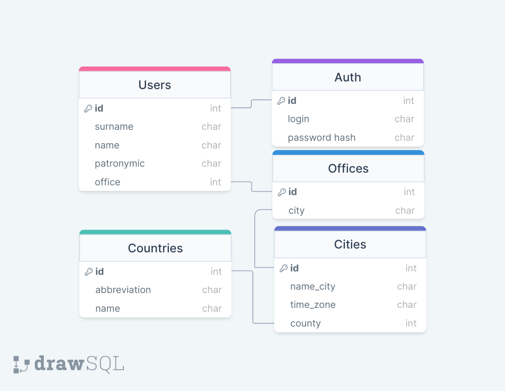

# Домашняя работа по SQL и QT
## Ход выполнения работы:
- :heavy_check_mark: Придумать базу данных
- :heavy_check_mark: Создать её схему в [DrawSQL](https://drawsql.app/) и описание к каждой таблице
- :x: Придумать и вывести запросы к бд
- :x: Обьяснить практическую пользу запросов
- :x: Написать приложение на PyQT отображающее таблицы БД и заполнить их
## Описание и схема базы данных:
- Users - Список пользователей
- Auth - Данные для авторизации(пароль храниться в виде хеша)
- Offices - Список офисов
- Cities - Список городов
- Countries - Список стран

 
